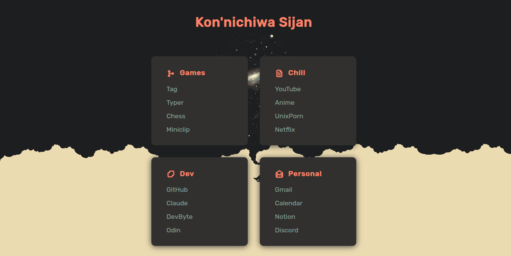

# sijan-dashboard

## Preview



A **minimal startpage** featuring the beautiful [Gruvbox](https://github.com/morhetz/gruvbox) color scheme, built using just plain HTML. This project is designed to be lightweight, distraction-free, and easily customizable for your personal workflow.

## Features

- **Gruvbox Theme:** Enjoy a soothing, eye-friendly palette inspired by the popular Gruvbox colors.
- **Minimalist Design:** Clean layout with no unnecessary scripts or dependencies.
- **Blazing Fast:** Pure HTML ensures instant load times.
- **Easy to Customize:** Edit the links and layout directly in the HTML file to suit your needs.

## Getting Started

1. **Clone this repository:**

   ```bash
   git clone https://github.com/Sijan-Bhusal/sijan-dashboard.git
   ```

2. **Open the startpage:**

   - Simply open the `index.html` file in your browser.

3. **Set as your browser start page (optional):**
   - In your browser settings, set the path to the `index.html` as your homepage or new tab page.

## Customization

Feel free to edit `index.html` to modify:

- **Quick Links:** Change the sites you visit most.
- **Colors:** Tweak the Gruvbox palette to your taste.
- **Layout:** Add sections, widgets, or your own touch.

---

> Inspired by the simplicity and warmth of Gruvbox.  
> Made with ❤️ by [Sijan Bhusal](https://github.com/Sijan-Bhusal)
